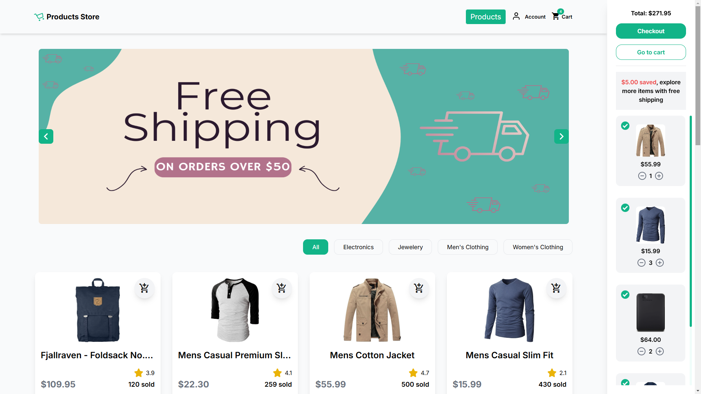
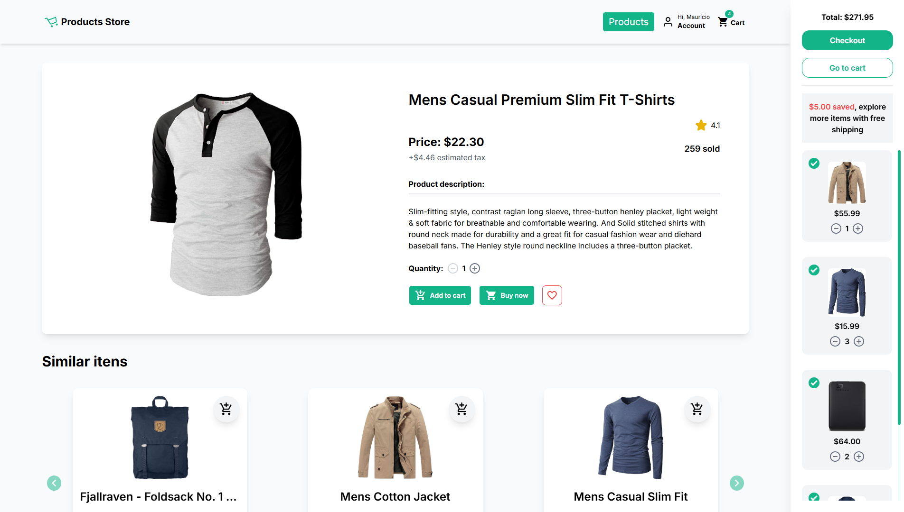
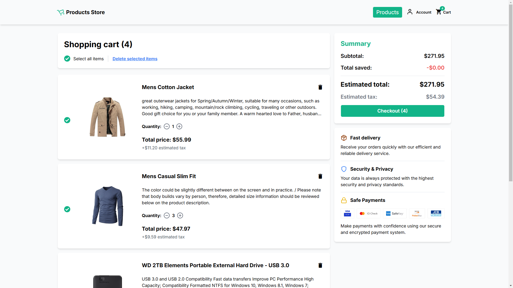
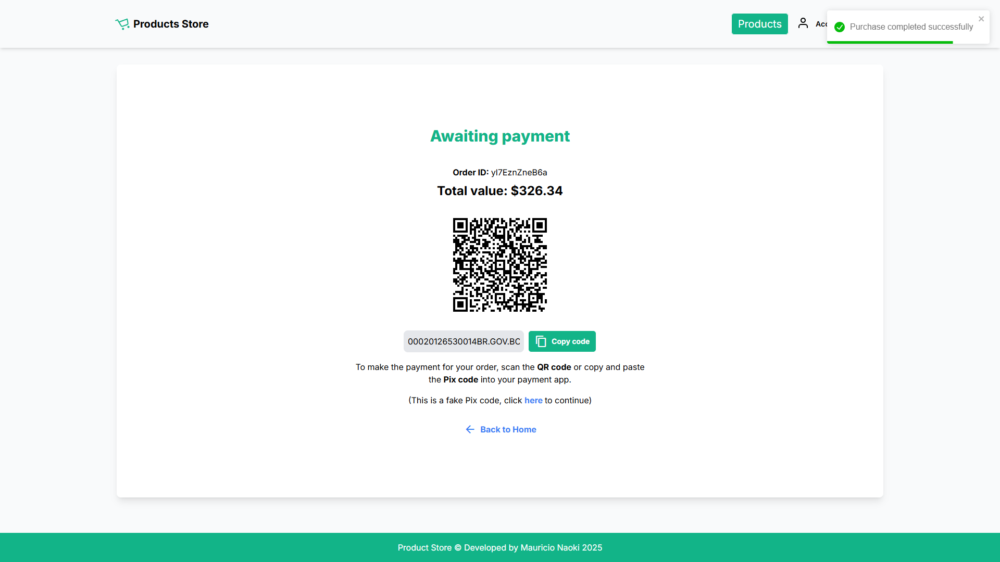
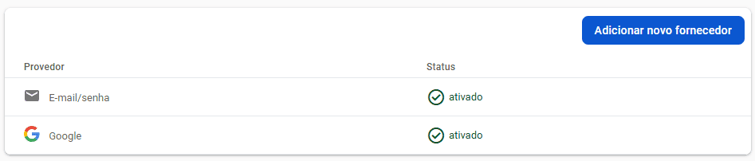

<div align="center"> <h1>Products Store</h1> </div>

<p align="center">Loja online desenvolvida com Nuxt.js, inspirada no AliExpress!</p>

<p align="center">
  
  
  
  
  
</p>

## 📝 Sobre o projeto

A aplicação foi desenvolvida com Nuxt.js, inspirada na experiência do AliExpress. Ela integra uma API fictícia para listar e exibir produtos, com o estado do carrinho gerenciado pelo Pinia e salvo no navegador. O backend foi construído com Nitro e é responsável por gerar QR Codes para pagamentos via Pix.

## 🛠 Tecnologias utilizadas

-   **Vue.js** - Framework JavaScript progressivo
-   **Nuxt.js** - Framework baseado em Vue.js para SSR
-   **Nitro** - Camada de servidor do Nuxt para backends e APIs
-   **Pinia** - Biblioteca de gerenciamento de estado
-   **Firebase** - Plataforma do Google com serviços para autenticação, banco de dados e hosting
-   **JavaScript** - Linguagem de programação para desenvolvimento web
-   **HTML** - Linguagem de marcação que estrutura o conteúdo na web
-   **CSS** - Linguagem de estilos usada para definir o visual das interfaces web
-   **Tailwind CSS** - Framework de estilos

## 🔥 Firebase

O Firebase foi utilizado para autenticação de usuários, controle de sessões e armazenamento de dados, como histórico de pedidos e itens favoritados pelos usuários.

## 📸 Screenshots

<p align="center">
  
</p>

<p align="center">
  
</p>

<p align="center">
  
</p>

<p align="center">
  
</p>

## 🌐 Acesse o projeto online
Você pode acessar a versão online do projeto [aqui](https://mauricio-products-store.netlify.app).

## 🖥️ Como configurar o projeto

Siga os passos abaixo para instalar e executar o projeto em seu ambiente local:

### 1. Clone o repositório:

```bash
$ git clone https://github.com/mauricio071/Products-Store
```

### 2. Acesse o diretório do projeto:

```bash
$ cd Products-Store
```

### 3. Instale as dependências necessárias:

```bash
$ npm install
```
ou

```bash
$ yarn install
```

### 4. Configure as variáveis de ambiente:

Crie um projeto no Firebase ([Vídeo tutorial](https://www.youtube.com/watch?v=C2upiyk85dE&ab_channel=CharlesNicollas)) para gerar as chaves e insira no .env do front-end:

```env
NUXT_PUBLIC_FIREBASE_API_KEY=
NUXT_PUBLIC_FIREBASE_AUTH_DOMAIN=
NUXT_PUBLIC_FIREBASE_PROJECT_ID=
NUXT_PUBLIC_FIREBASE_APP_ID=
```
Também será necessário configurar os métodos de autenticação. Para isso, ative as opções de login com Google e e-mail/senha na aba **Authentication** do Firebase:




### 5. Inicialize o projeto:

```bash 
$ npm run dev
```
ou, se estiver usando yarn:

```bash 
$ yarn dev
```
Agora você pode acessar o projeto no navegador em http://localhost:3000 (ou na porta indicada pelo terminal).
